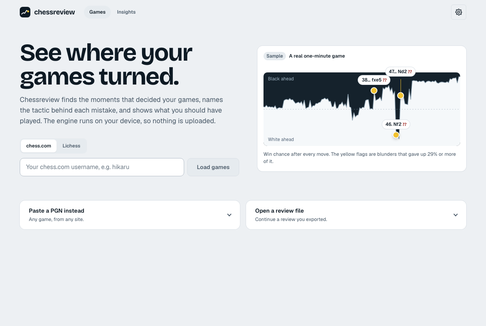
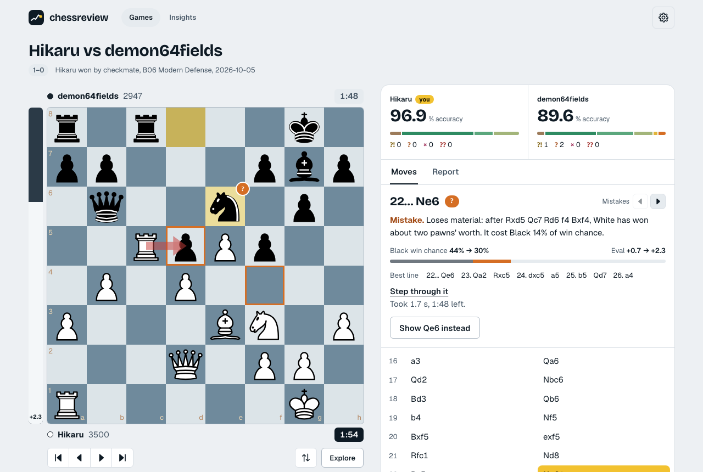
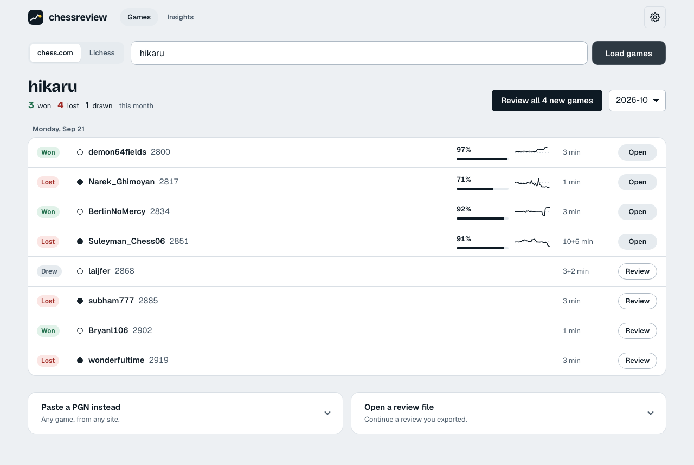
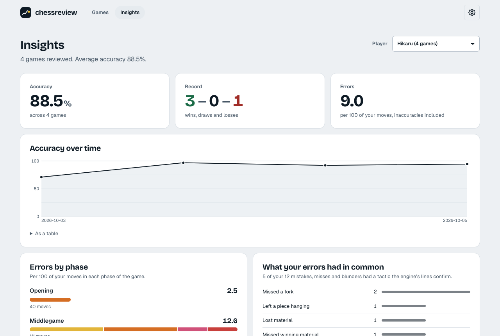
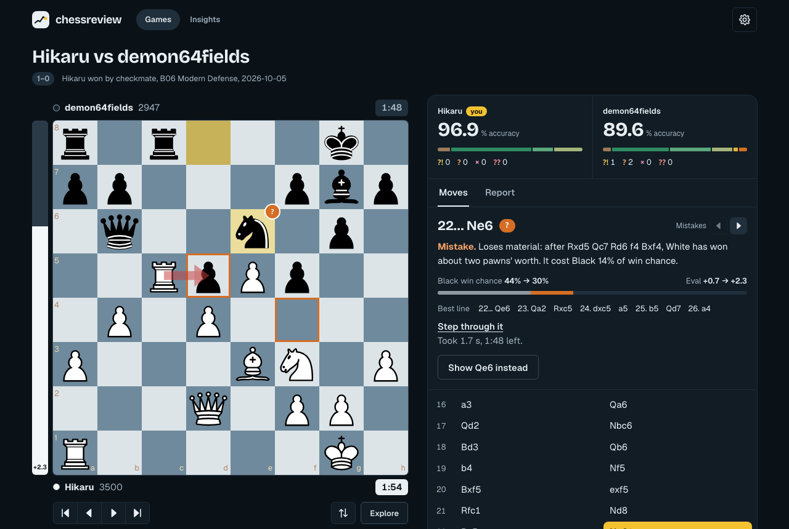
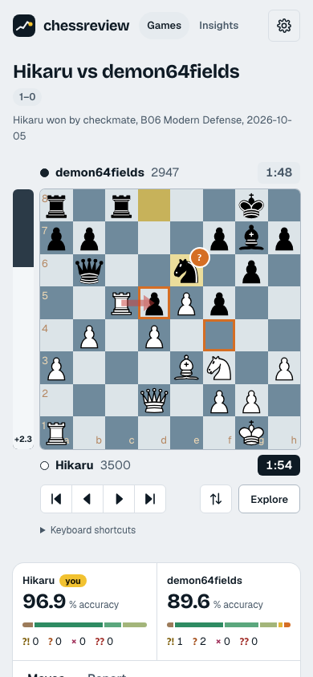
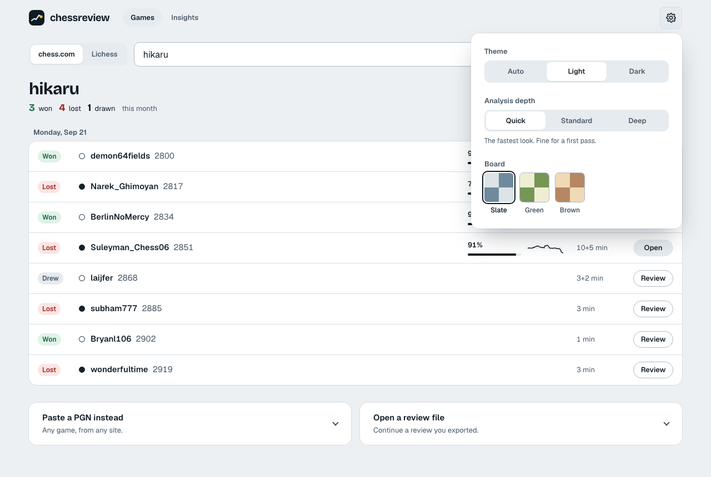

# chessreview

Chess game review that runs entirely in your browser: move labels (brilliant, great, book, best … blunder,
miss), accuracy, a win-chance graph, accuracy by phase and a plain-language summary. Stockfish runs in Web
Workers on your own CPU, so there is no server, no account, and your games never leave your device.

Import games from a chess.com or Lichess username, or paste any PGN. "Review all new games" queues every
unreviewed game in the list; the queue keeps going if you leave the page and picks up again after a
reload. A review can be downloaded as an annotated PGN (labels as NAGs, `[%eval]` and `[%clk]`
comments) or as a review file, which opens on another device.

  

  

  
  

  
  
  

Regenerate these with `pnpm build && pnpm screenshots`; they are real output of the app, not mock-ups.

## Develop

    pnpm install
    pnpm dev             # http://localhost:5173
    pnpm check           # types, lint, formatting, unit + integration tests
    pnpm e2e             # builds, then runs the browser tests against the production build
    pnpm budget          # after a build: checks the download stays within its size budget
    pnpm screenshots     # after a build: regenerates the pictures in docs/screenshots

Requires Node 22+ and pnpm 10 (`corepack enable` picks up the version pinned in `package.json`).
`pnpm install` fetches the Stockfish WASM build (the `stockfish` package's postinstall, the only
dependency build script allowed in `pnpm-workspace.yaml`); `predev` and `prebuild` copy it into
`apps/web/public/engine`. The first time you run the browser tests, install Chromium with
`pnpm --filter @chessreview/web exec playwright install --with-deps chromium`.

## How it is organised

| Path               | What                                                                                                                                    |
| ------------------ | --------------------------------------------------------------------------------------------------------------------------------------- |
| `packages/core`    | Pure review logic: rules, accuracy, phases, opening book. Runs anywhere.                                                                |
| `packages/engine`  | UCI client, Web Worker and Node transports, parallel engine pool.                                                                       |
| `apps/web`         | React app, services layer (chess.com, storage, review queue), e2e tests.                                                                |
| `reference/python` | Original implementation, kept as the test oracle for `core`.                                                                            |
| `docs/`            | [Architecture](docs/ARCHITECTURE.md), [decision records](docs/adr/README.md), [deployment](docs/DEPLOY.md), [roadmap](docs/ROADMAP.md). |

## How moves are labelled

Win chance comes from the engine evaluation (the Lichess formula). A move is labelled by how much win chance
it gave up:

| Label                          | Rule                                                                                          |
| ------------------------------ | --------------------------------------------------------------------------------------------- |
| Brilliant                      | within 2% of best, gives up 2+ pawns by exchange, game not already decided (45–90%)           |
| Great                          | the best move, runner-up 20%+ worse, in a contested position (25–75%), and not a recapture    |
| Book                           | the position is on a known opening line                                                       |
| Best / Excellent / Good        | engine's choice / gave up up to 2% / up to 5%                                                 |
| Inaccuracy / Mistake / Blunder | gave up up to 10% / 20% / more                                                                |
| Miss                           | a mistake or blunder right after the opponent made one (10%+), from an at-least-even position |

For mistakes, blunders, misses, great and brilliant moves the review also says _why_, when the
engine's own lines show it: a piece left hanging, a fork, pin, skewer, discovered attack, trapped
piece or overloaded defender, a missed or allowed mate, a recapture, or the material a line wins. The
squares involved are ringed on the board and the best line is shown in full. When no tactic can be
confirmed from the engine's lines, the review says only what the move cost.

Click any move of the best line to step through it, or move a piece on the board to explore your
own ideas: the engine evaluates each position live. Exploring never changes the stored review.

**Insights** (linked from the home page) sums up every game reviewed on your device for one player:
accuracy over time, errors per 100 moves by phase, the tactics behind your mistakes, and your results
by opening and time control. It is computed in your browser from your stored reviews.

Sites that host the full Stockfish network can offer an **accurate engine** as a one-time 99 MB
download (Settings → Engine), which matches desktop Stockfish exactly; see `docs/DEPLOY.md`.

When the PGN carries clock times (chess.com and Lichess exports do), each move shows how long it took,
and the Report tab graphs both clocks and counts the errors made in time trouble (under a tenth of the
starting time, at most two minutes) against the rest.

These are heuristics, not chess.com's proprietary rules, so labels differ from theirs. The rating shown in the
Report tab is a rough estimate from average centipawn loss, not a calibrated rating.

## Contributing

See [CONTRIBUTING.md](CONTRIBUTING.md) for the checks to run, where code goes, and the procedure for
changing a review rule. Changes are listed in [CHANGELOG.md](CHANGELOG.md); to report a vulnerability,
see [SECURITY.md](SECURITY.md).

## Licence

GPL-3.0-or-later (see `LICENSE`). The bundled engine is Stockfish.js by Nathan Rugg and Chess.com, LLC, built from
Stockfish by the Stockfish developers, also GPL-3.0. Opening data: [lichess-org/chess-openings](https://github.com/lichess-org/chess-openings), CC0.
